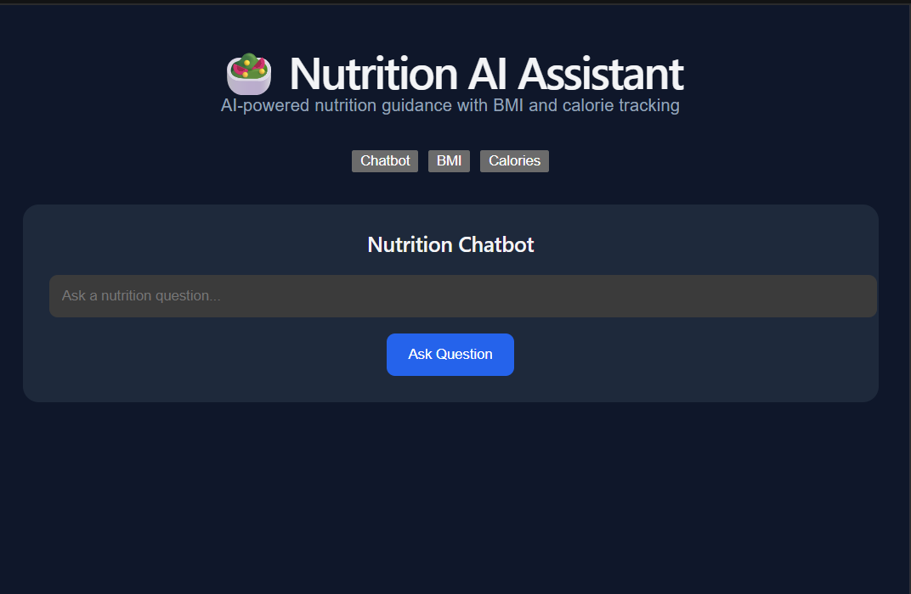
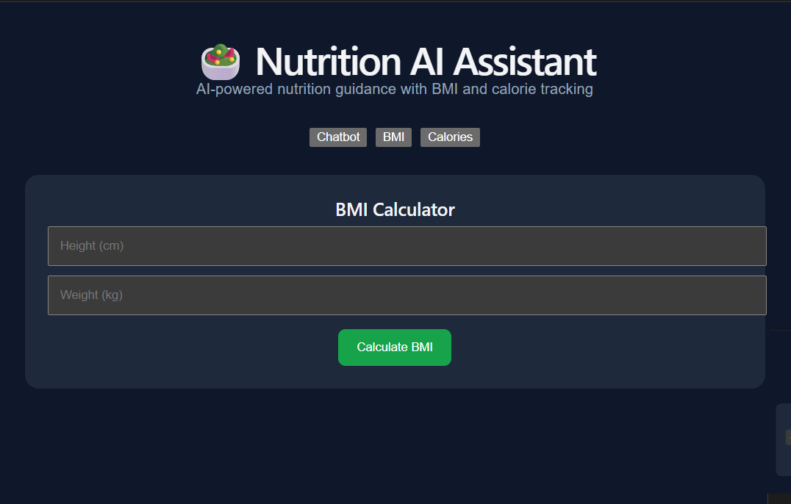
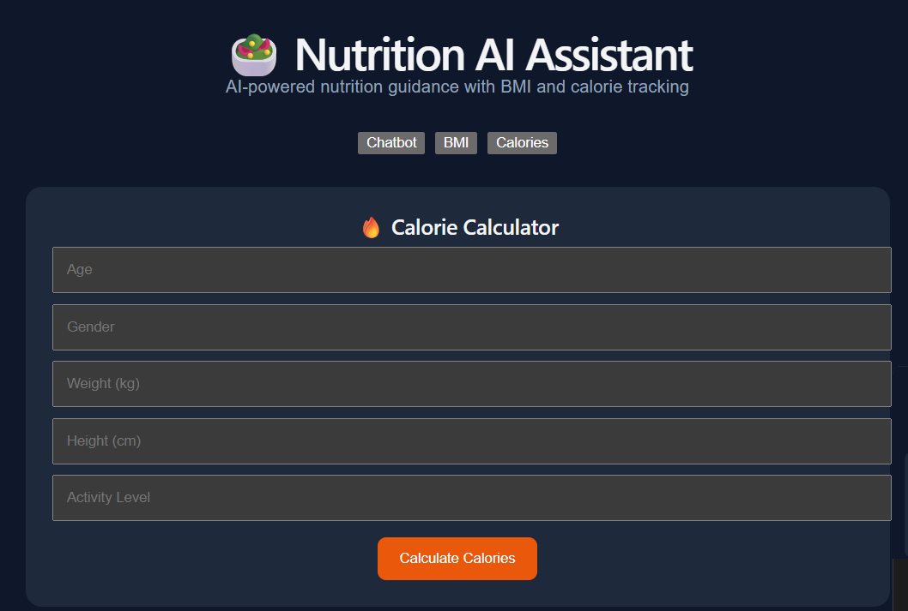
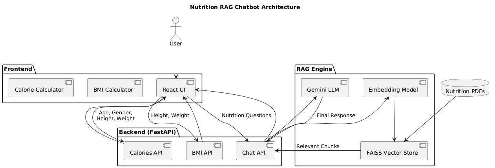

# 🥗 Nutrition AI Assistant

A full-stack AI-powered nutrition assistant built using React, FastAPI, FAISS, and Gemini. The application answers nutrition-related questions using Retrieval-Augmented Generation (RAG), while also providing BMI and Calorie calculation tools.

---

## 🚀 Features

### 🤖 Nutrition RAG Chatbot

* Ask nutrition-related questions in natural language.
* Retrieves relevant information from nutrition PDF documents.
* Uses semantic search with FAISS vector database.
* Generates source-grounded responses using Gemini.

### 📊 BMI Calculator

* Calculates Body Mass Index from height and weight.
* Categorizes users as:

  * Underweight
  * Normal
  * Overweight
  * Obese

### 🔥 Calorie Calculator

* Calculates Basal Metabolic Rate (BMR).
* Estimates daily maintenance calories.
* Provides calorie targets for:

  * Weight Loss
  * Weight Maintenance
  * Weight Gain

### 🎨 Modern Frontend

* Built with React.
* Responsive user interface.
* Separate sections for Chatbot, BMI, and Calorie calculations.

---


---

## 📸 Application Screenshots

### 🏠 Home Page



### 📊 BMI Calculator



### 🔥 Calorie Calculator



### 🏗️ System Architecture



---


# 🏗️ System Architecture

```text
User
  │
  ▼
React Frontend
  │
  ├── Nutrition Chatbot
  ├── BMI Calculator
  └── Calorie Calculator
  │
  ▼
FastAPI Backend
  │
  ├── /chat
  ├── /bmi
  └── /calories
  │
  ▼
RAG Pipeline
  │
  ├── Embeddings (all-MiniLM-L6-v2)
  ├── FAISS Vector Search
  └── Gemini 2.5 Flash
  │
  ▼
Nutrition PDF Knowledge Base
```

---

## 🧠 How the RAG Pipeline Works

1. Nutrition PDFs are loaded and processed.
2. Documents are split into smaller chunks.
3. Chunks are converted into embeddings using Sentence Transformers.
4. Embeddings are stored in a FAISS vector database.
5. User questions are converted into embeddings.
6. FAISS retrieves the most relevant chunks.
7. Retrieved context is passed to Gemini.
8. Gemini generates the final answer.

---

## 🛠️ Tech Stack

### Frontend

* React
* JavaScript
* Vite

### Backend

* FastAPI
* Python

### AI & RAG

* Gemini 2.5 Flash
* FAISS
* LangChain
* Sentence Transformers

### Document Processing

* PyPDF

---

## 📂 Project Structure

```text
nutrition-chatbot/
│
├── backend/
│   ├── main.py
│   ├── create_vector_db.py
│   └── test_retrieval.py
│
├── frontend/
│   ├── src/
│   └── public/
│
├── data/
│   └── nutrition_pdfs/
│
├── vectorstore/
│   ├── index.faiss
│   └── index.pkl
│
├── requirements.txt
└── README.md
```

---

## ⚙️ Installation

### Clone Repository

```bash
git clone <repository-url>
cd nutrition-chatbot
```

### Backend Setup

```bash
pip install -r requirements.txt
```

Create a `.env` file:

```env
GEMINI_API_KEY=YOUR_API_KEY
```

Start backend:

```bash
uvicorn backend.main:app --reload
```

---

### Frontend Setup

```bash
cd frontend
npm install
npm run dev
```

Open:

```text
http://localhost:5173
```

---

## 📡 API Endpoints

### Chatbot

```http
POST /chat
```

Request:

```json
{
  "question": "What foods are rich in protein?"
}
```

---

### BMI Calculator

```http
POST /bmi
```

Request:

```json
{
  "height": 175,
  "weight": 70
}
```

---

### Calorie Calculator

```http
POST /calories
```

Request:

```json
{
  "age": 22,
  "gender": "male",
  "weight": 70,
  "height": 175,
  "activity_level": "moderate"
}
```

---

## 🎯 Future Improvements

* Docker Deployment
* AWS Deployment
* Nutrition PDF Upload Feature
* User Authentication
* Chat History Storage
* Meal Recommendation System

---

## 👨‍💻 Author

Developed as a full-stack AI project demonstrating:

* Retrieval-Augmented Generation (RAG)
* Vector Search
* FastAPI Backend Development
* React Frontend Development
* AI Application Engineering
